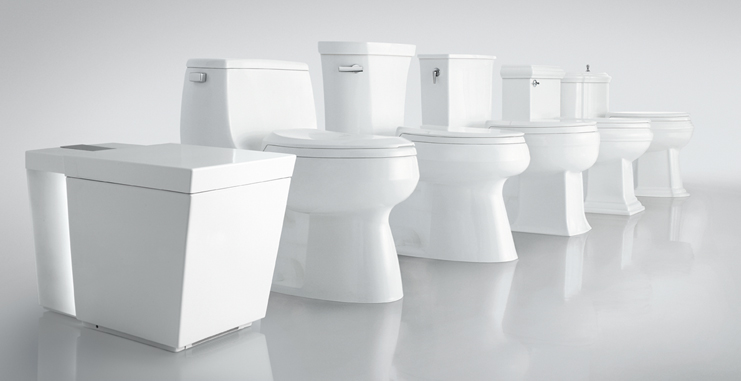
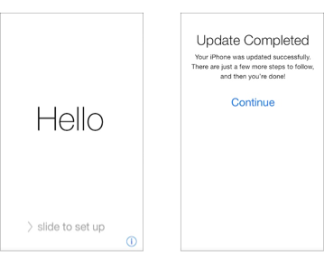
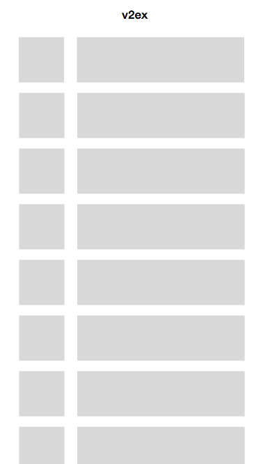

## [第 8 天 - 以设计马桶的方法来设计 App](day8)

乔教主曾经说过：

> “Design is not just what it looks like and feels like. Design is how it works.”

我们今天要忘掉上周所学的各种设计知识。色彩，字体，阴影都不重要。今天，我们把注意力集中在人和界面的互动关系，也就是 "how it works"。

虽然设计的最终目标都是 “好用”，扁平化潮流兴起之后对 “好用” 有了和拟物风很不一样的诠释。

我们今天只看 iOS HIG 的一部分：

[Designing for iOS - Human Interface Guideline](https://developer.apple.com/library/ios/documentation/UserExperience/Conceptual/MobileHIG/index.html#//apple_ref/doc/uid/TP40006556-CH66-SW1)

> [为iOS而设计 - iOS 人机界面指南 - 中文翻译](http://www.uisdc.com/ios8-gui-design-guideline#1.1)

这篇文不长，但很抽象。多读几遍，和手上的几个应用对比一下。

苹果公司的牛逼之一是他们有种把这个设计理念发挥到了几乎迷信的地步 (把所有不需要的东西都去除掉，然后再去除掉一些东西)。iOS8 启机的欢迎页面如下：

你真这么干老板可能心里会想：“窝巢，我们公司该请个设计师了”。

所以我们 2B 设计师只好这样整：

看 HIG 里面的例子的时候，你不能光看苹果怎么做，你应该思考苹果为什么那么做，同时也多看市场上其他应用怎么以不同的方式呈现同样的设计理念。

# 练习

我们来为 v2ex 设计一个 App。今天的目标是设计出 v2ex 的线框图。设计两个页面：

1. 文章列表
2. 文章页面。例：[刚搭的一个 DNS：「任我行 DNS」](http://v2ex.com/t/160124#reply59)

## 温馨提示

+ 用简单的灰色方块。文字用灰色调。这个例子非常不完整，你应该加上更多细节。

  

+ 把 “真实数据” 放到你的设计里面，不要用 lorem ipsum

  

+ 分解功能。Question your assumptions。 那些功能应该留在移动端，那些应该去除？
  + 感谢
  + 回复
  + 收藏
  + 登入
  + 投票功能
  + 屏蔽用户

虽然网上可以找到比较 [细致的线框图框架](http://blog.mengto.com/how-to-wireframe-an-iphone-app-in-sketch/)，我觉得还是丑陋的灰色方块最好。

